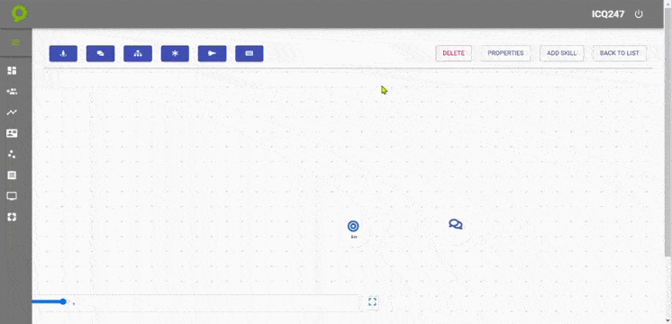

---

<h2>Ahora Veremos la Creacion de Nuestro Bot`s</h2>

<h3>Aqui le explicaremos todas la configuraciones y funciones que tenemos para nuestro bot`s y la estructuracion de nuestro flujo</h3>

<h3>en la siguiente pantalla podemos hacer click en este botón para dar inicio a nuestra creacion de nuestro bot`s</h3>

<h3>En esta pantalla podremos agregar solo el nombre de nuestro Bot`s luego nos abrira la parte de configuracion del bot donde nos presentará la siguiente pantalla</h3>

---

<h3>Esta seria nuestra pantalla para dar inicio a la configuracion de nuestro bot`s donde tenemos:</h3>

<h3>Nuestra Barra de herramientas</h3>

<h3>Aquí tenemos todo lo necesario para la construcción del flujo y para la configuración de cada paso dentro del flujo.</h3>

<h3>Área de construcción del flujo</h3>

<h3>Este seria nuestro mapa donde vamos a conectar nuestros nodos y darle forma a nuestro flujo</h3>

<h3><a>Aqui veremos la parte de como vamos a enlazar cada Nodo</a></h3>

<h3>Para Hacer la conexion de nodo a nodo debemos tener la tecla SHIFT presionada donde luego debe dar un click izquierdo al nodo inicial luego arrastramos nuestro mouse al secundario que seria el que queremos enlazar</h3>

<h3>Aqui un pequeño ejemplo:</h3>

<h3>Mas adelante le vamos a definir cada uno de los modulos y botones de nuestra <a>"Barra de Herramientas"</a></h3>

---
