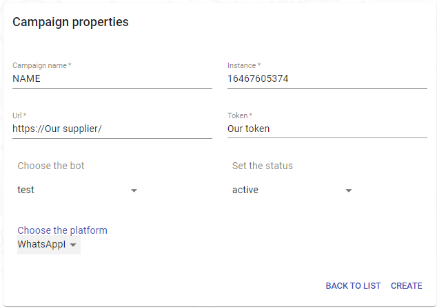

---

<h3>En esta parte vamos a explicar cada campo y como configurar nuestra campaña mediante whatsApp</h3>
<h3>La plataforma de whatsaap debemos agregar los parametros manualmente estos parametros debemos pedirlos a nuestro proveedor ya que para hacer nuestra conexion debemos agregar los siguientes campos</h3>

<h3>Estos son los campos que vamos a necesitar que nuestro proveedor nos conceda</h3>
<ul><h3><li><a>Intance: </a>Este seria nuestro numero para nuestra campaña</li></h3></ul>
<ul><h3><li><a>Url: </a>Esta campo es para nuestra conexion con nuestro proveedor</li></h3></ul>
<ul><h3><li><a>Token: </a>Aqui es donde vamos agregar nuestro token ya para dar la conexion final con nuestro proveedor</li></h3></ul>

<h3>Estos serian los campos que vamos a necesitar que nuestro provedor nos conceda pero el campo llamado <a>"Campaign name" </a>es el nombre que queremos a identificar nuestra campaña</h3>

<!-- <h3>Si queremos agregar otro provedor  usariamos el mismo metodo que whatsaap el unico metodo que cambia para configuracion y demas es con "Facebook",</h3>

<h3>Estos serian los provedores que podemos usar con el metedo anteriormente explicado</h3>

<h3><li><a>Web</a></li></h3>
<h3><li><a>Twilio</a></li></h3>
<h3><li><a>SMS</a></li></h3>
<h3><li><a>Intagram</a></li></h3>
<h3><li><a>Telegram</a></li></h3> -->
