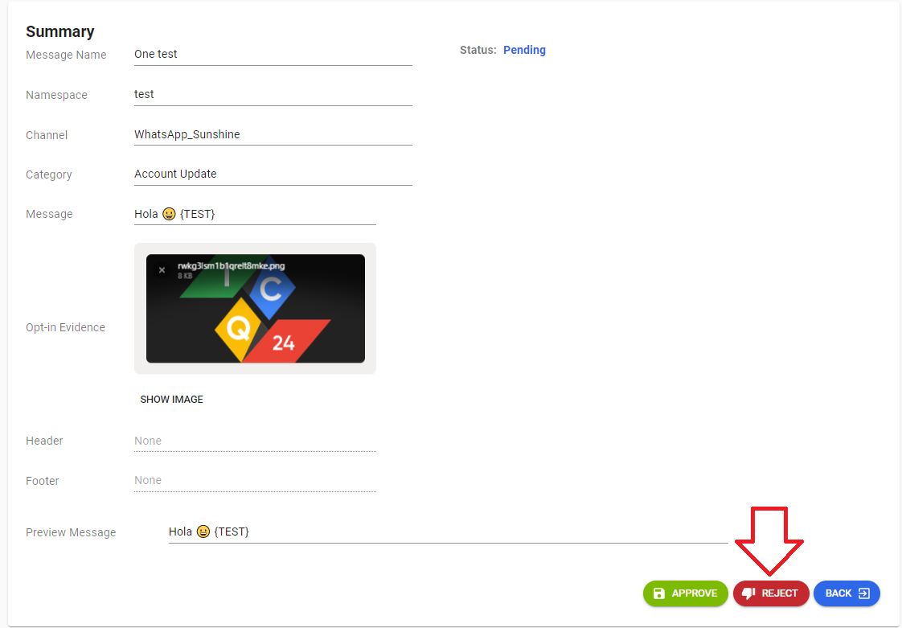
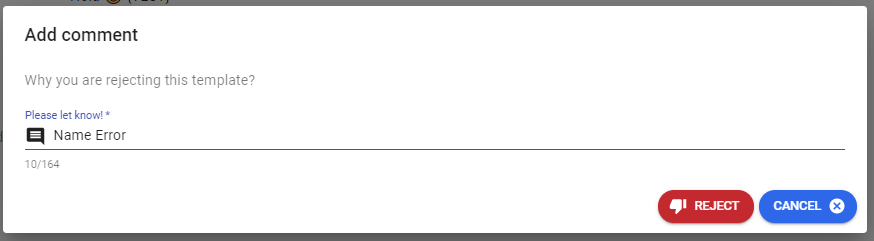
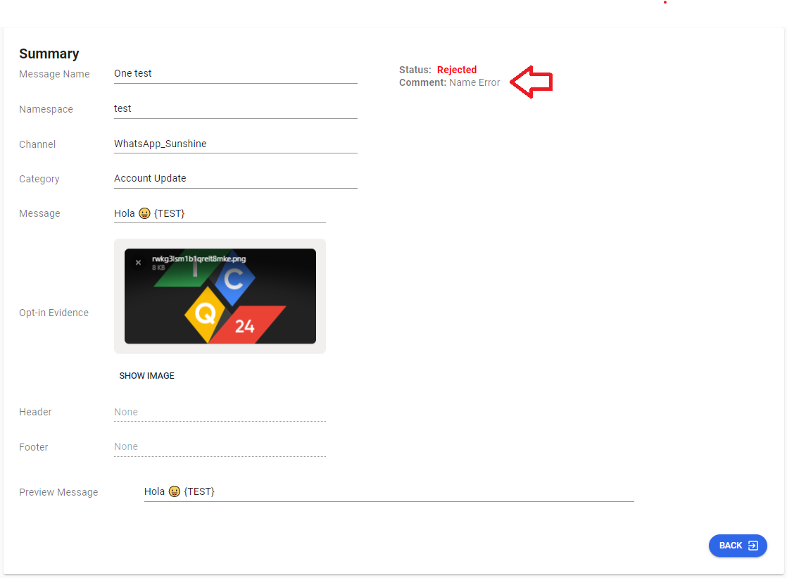

---

<h3>Aqui le explicaremos el flujo de como rechazar una plantilla donde tenemos la opcion de poner un comentario de por que sera rechazada nuestra plantilla</h3>

<h3>El primer paso seria entrar en la parte de edicion de nuestra plantilla</h3>

<h3>Luego pasamos a rechazar nuestra plantilla inmediatamente damos click en rechazada nos trae una pantalla con la opcion de agregar un comentario de por que la estamos rechazando</h3>

<h3>Esta sera nuestra pantalla para informar el motivo por el cual ha sido rechazada nuestra plantilla</h3>

<h3>Cuando le damos click a REJECT luego nos agrega en la parte de abajo de status el comentario añadido</h3>

