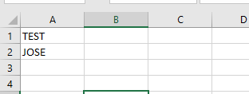
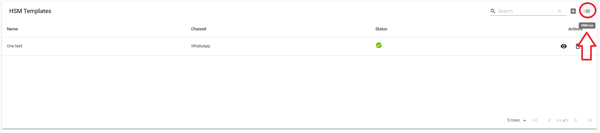
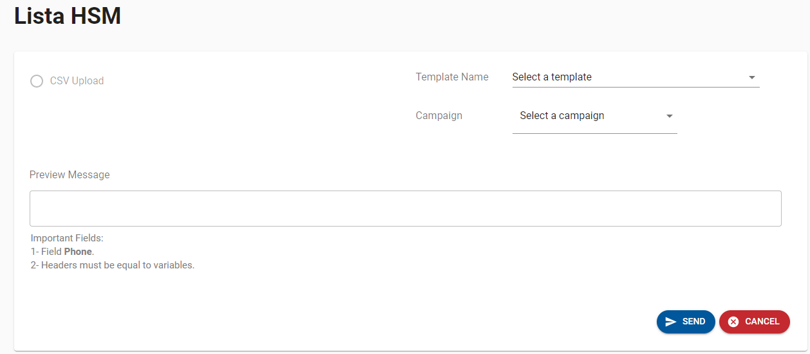
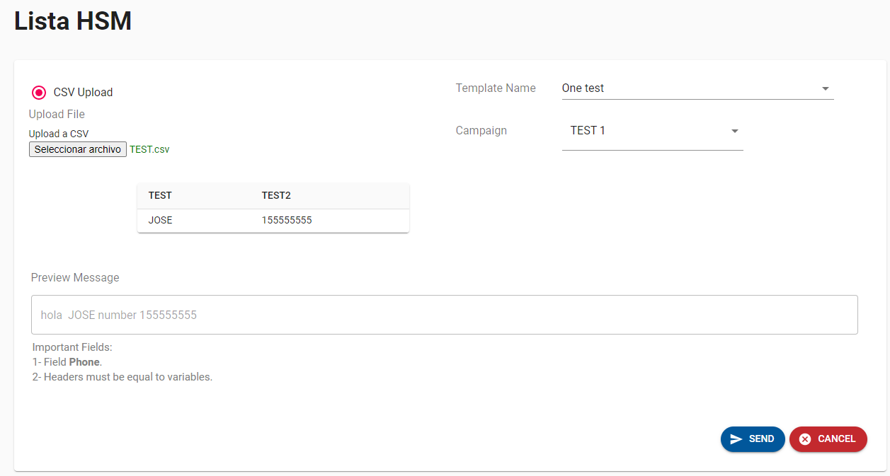
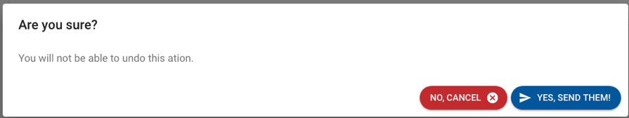

---

<h3>Aquí es donde enviaremos las plantillas donde lo principal a tener en cuenta es que si queremos enviar las plantillas que hemos creado, nuestra plantilla debe ser aprobada por un usuario administrativo y entonces podremos enviar nuestra plantilla.</h3>

<h3>En este momento estamos enviando los mensajes mediante un <a>CSV</a>  ("Comma-separated values") este fichero debe contener como cabecera las variables que creamos o que hemos vinculado a nuestra plantilla.</h3>

<h3>Para añadir nuestro csv debemos seguir los siguientes pasos, ¿por qué?</h3>

:::info

Nuestra opción de añadir el CSV está desactivada porque para activarla debemos seleccionar la plantilla que vamos a utilizar y la campaña después de hacer este paso se activa y podemos añadir nuestro CSV.

:::

<h3>Example</h3>

<h3>ahora veamos como seria el envio de nuestra plantilla</h3>

<h3>En primer Lugar para entrar a <a>HSM LIST </a>("Highly Structured Message") le debemos dar click a este Icono</h3>

<h3>Luego que le demos click a nuestro icono nos muestra la siguiente ventana</h3>

<h3>Definicion de campos</h3>

<h3><a>-Template Name:</a>   Se refiere a escoger la plantilla que se desea enviar</h3>

<h3><a>-Campaign:</a>  Aquí se debe seleccionar la campaña asociada al numero de teléfono por el cual se estarán enviando los mensajes a los clientes.</h3>

<h3><a>-CSV:</a>  Este archivo de contener todos los números a ser contactados mediante el envío de mensajes masivos, y debe constar con la siguiente estructura. </h3>

<ul><h3>A. Debe contener un campo con el encabezado de nombre “phone” que corresponde a los teléfonos de los usuarios que se le enviaran los msg.</h3>

<h3>B. Debe contener variables en la plantilla, en el archivo debe haber una columna adicional por cada variable y debe tener como encabezado el mismo nombre de la columna.</h3>
</ul>

<h3><a>-Vista Previa del mensaje:</a>  La pagina te mostrará una vista previa del primer mensaje de la lista para que se pueda visualizar como le estará llegando el mensaje al cliente final.</h3>

<h3><a>-Vista del CSV:</a> En la pagina se cargarán los registros del archivo sometido para visualizar los registros que se van a procesar.</h3>

<h3>-Una vez ya cuando todo este cargado en el sistema esta es la vista que se puede apreciar con toda la información lista para ser enviada.</h3>

<h3>-Ya que tenemos  todo listo  le daremos al botón   en la parte inferior derecha.</h3>

<h3>-Esta es nuestra pantalla de confirmación para asegurar que realmente se quiere procesar el envío de los mensajes con la lista previamente cargada.</h3>

<h3>Una ves se le de al botón    se enviarán todos los mensajes.</h3>

<h3>-En la parte centrar abajo mostrara un mensaje notificando el estado del envío.
ya sea que fue enviado exitosamente la lista de los contactos, o si se produjo cualquier error al procesar el envío de los mensajes.
</h3>

---

<h3><a>¿Qué es HSM?</a></h3>

<ul><h3>Es una plantilla utilizada para enviar mensajes salientes a sus clientes. Todos los HSM deben estar aprobados por WhatsApp antes de su uso; esto garantiza que siga las pautas de contenido permitidas.</h3></ul>

<h3><a>¿Qué es un archivo CSV?</a></h3>

<ul><h3>es un tipo especial de archivo que puede crear o editar en Excel. En lugar de almacenar la información en columnas, los archivos CSV almacenan datos separados por comas. Cuando el texto y los números se guardan en un archivo CSV, es fácil moverlos de un programa a otro. Por ejemplo, puede exportar los contactos de Google a un archivo CSV y, luego, importarlos a Outlook.</h3></ul>

---
