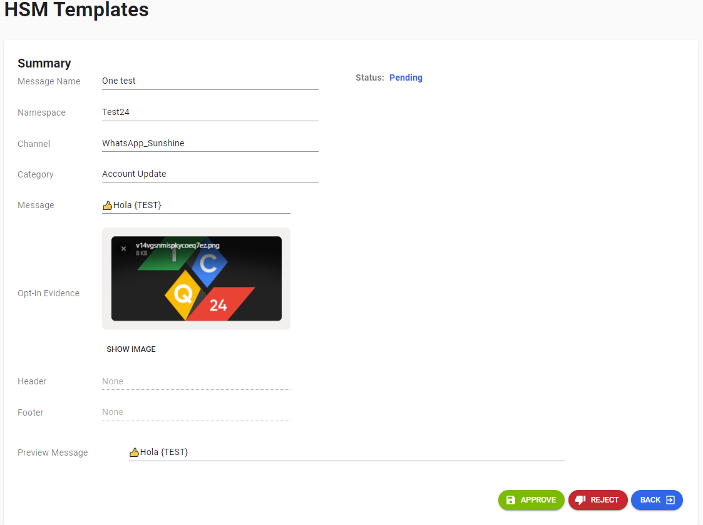
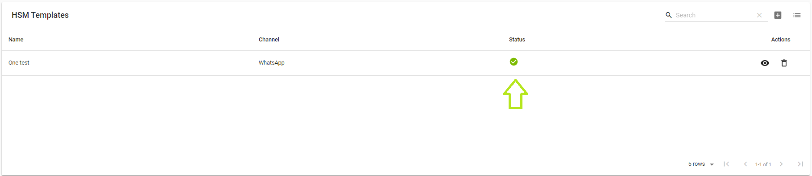

---

<h3>Aqui veremos la parte de aprobacion de la plantilla un punto a tener pendiente es que si la plantilla que creamos la queremos enviar debe estar aprobada "Esto paso obligatorio".</h3>

<h3>Vamos a visualizar una plantilla que ya tenemos guardada entonces vamos a pasar a editar dicha plantilla</h3>

<h3>Le Daremos Click al boton de editarla plantilla</h3>

<h3>Le daremos click a Approve</h3>

<h3>Ahora nos muestra que nuestra plantilla a sido aprobada, ya que la plantilla ha sido aprobada podemos enviar nuesto mensaje En HSM List,</h3>

<h3>Y listo esto seria la creacion de plantillas y sus flujos</h3>

