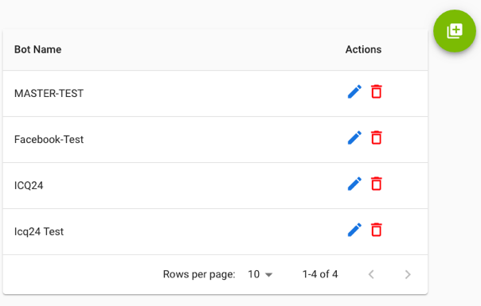
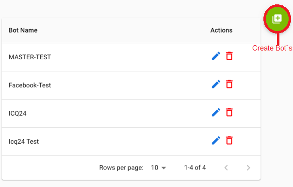
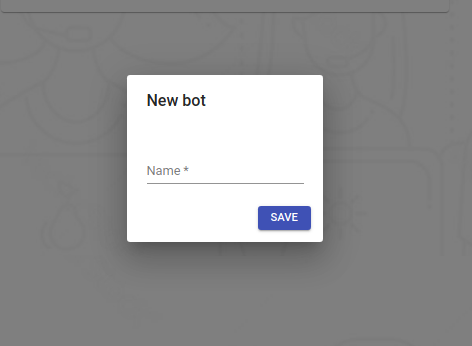
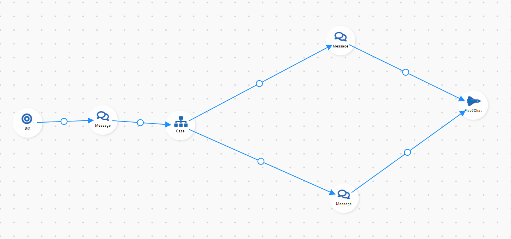
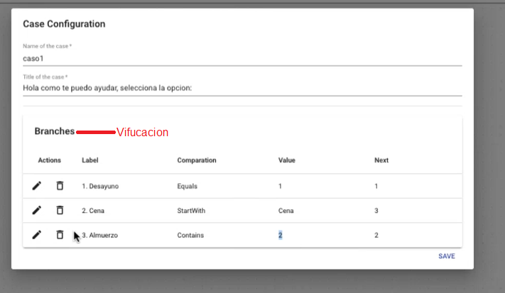
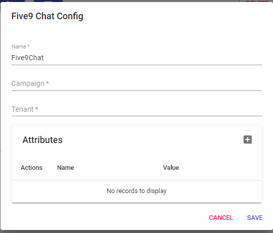
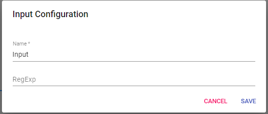

---

## View all Bots

### The system has an integrated robot to program the automatic interaction of end users, very easy to create your own flows and a very friendly way to configure it. in a few minutes you will have your customers interacting with them.

### By entering this option you can quickly see a list of all the robots that have been programmed and you have the option of creating new ones, according to your needs.

---

## Create and Edit

### Here we can click on this button where it gives us the option to create our Bot`s where we will be presented with the following screen

### in this screen we will be able to add only the name of our Bot`s then we go to edit it where we will be presented with the following screen

---

## Toolbar

### Here we have everything necessary for the construction of the flow and for the configuration of each step within the flow.

### Flow Construction Area

##

### - Bot`s: Conversation start

### 1- SkillTransfer: This state is in the process of being created and will not be used for the moment.

### 2- Message: What our bot`s reply when receiving a message

### 3- Case: Is where we will show an option to our customer where we can put several messages and each message brings a response to the customer.

### For Examples:

### 4- Connector: This module is in process for the moment we are not going to use it.

### 5- Five9Chat: This module will be used for the connection with Five9 where we have to pass the campaign that we want to receive in five9 also we must add the Tenants that would be in this case our client.

### 6- Input: Is where we are going to save information and this information will be passed to a variable where we can call it in the Five9Chat module.

---

---
