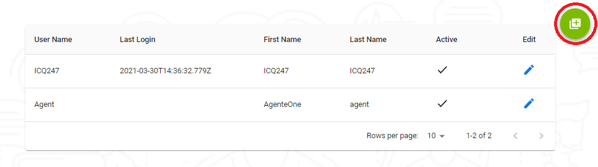
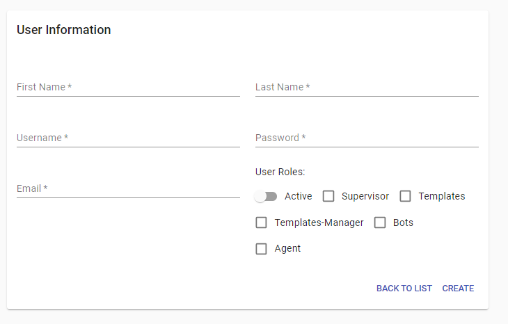
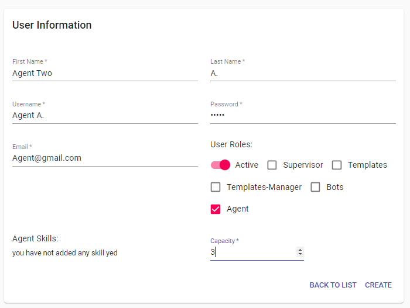
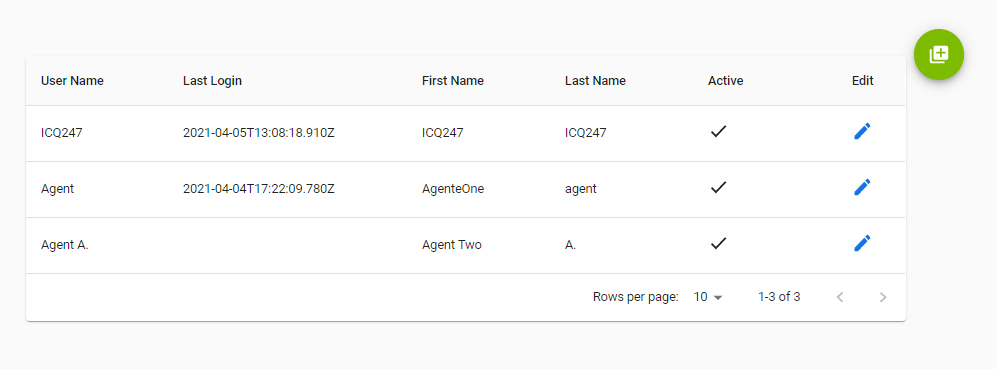

---

<h3>En esta parte veremos la creacion de usuarios y la definicion de sus campos</h3>

<h3>para Iniciar la creacion de nuestro usuario debemos darle click a este icono que le vamos a resaltar en la siguiente imagen</h3>

<h3>luego de que le demos click esta sera la pantalla donde vamos a crear nuesto usuario.</h3>

---

<h3>Ahora le vamos a definir cada campo y la utilidad que tienen</h3>

<h3>First Name: Este seria el nombre que vamos asignar al usuario para visuaizar en la instacia</h3>
<h3>Last Name: Este campo tiene la misma utilidad que el anterior solo que seria el apellido del usuario</h3>
<h3>Username: Aqui Asinaremos como el usuario se logeara en nuestra instancia</h3>
<h3>Password: Este campo es importante igual que username ya que con estos campos es que nos logearemos en nuestra instancia</h3>
<h3>Email: se utilizara para la comunicacion al usuario mediante su correo</h3>

<h3>Aqui esta la parte del manejo de los roles <a href="/docs/user">Click Aqui!</a></h3>

---

<h3>Empecemos con la creacion de usuario que sera agente en nuestra instancia</h3>

<h3>Si queremos crear el usuario solo debemos darle a CREATE o para regresar es solo dar a click BACK TO LIST y regresamos a nuestra lista de usuario</h3>

<h3>Y listo ya tenemos nuestro usuario creado</h3>