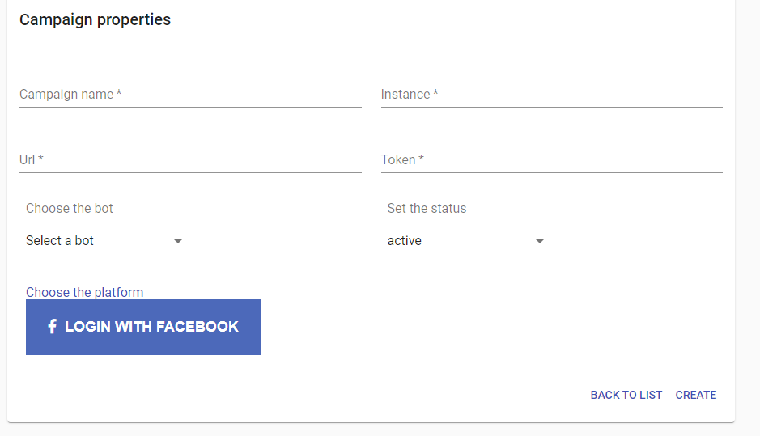
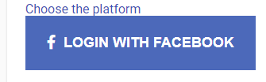
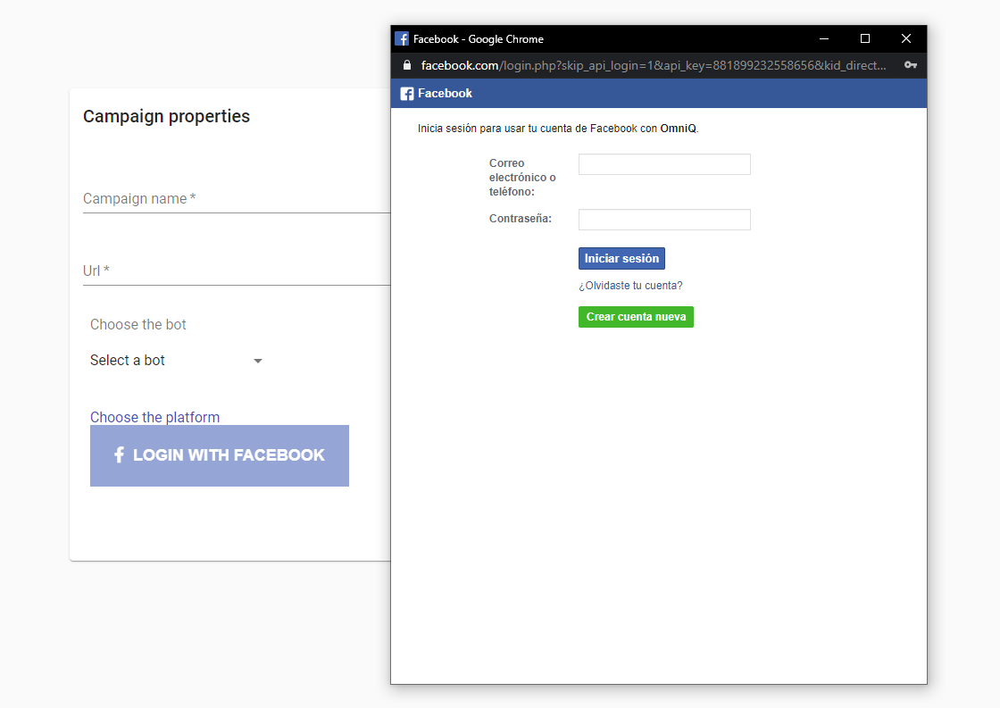
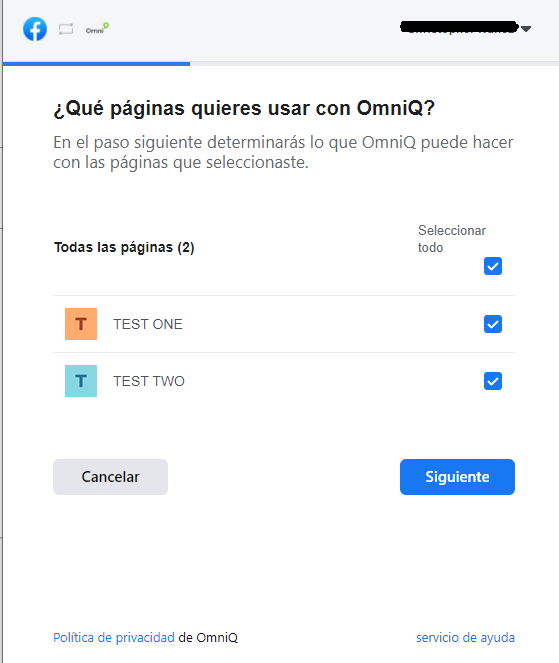
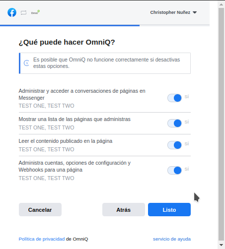
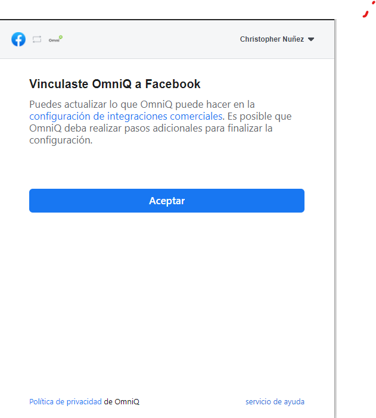

---

<h2>Creacion de Nuestra Campaña</h2>

<h3>Aqui le mostraremos los pasos de como Crear las campañas y la definicion de sus campos a rellenar</h3>

<h3>En esta parte veremos un pequeño botón, que al pulsarlo nos mostrará una pantalla para crear nuestras campañas.</h3>

<h3>Esta sería nuestra pantalla para la creación de las campañas</h3>
<h3>En la creación de nuestra campaña solo tenemos la opción de entrar con whatsapp por el momento mas adenlante tendremos mas integraciones</h3>

<h2>Definicion de los campos</h2>
<h3><a>Nombre de la Campaña:</a> Este seria el Nombre con el que vamos a identificar nuestra campaña</h3>
<h3><a>Instancia:</a> Este seria el numero asignar a nuestra campaña debemos tener en cuenta que debemos poner el mismo numero que tenemos en nuestro proveedor </h3>
<h3><a>URL:</a> Esta seria nuestra url que nuestro provedor nos habilito para nuestra campaña</h3>
<h3><a>Token:</a> Debemos tener un token para acceder mediante la url este campo es muy importante ya que es el primordial para la conexion con nuestro provedor</h3>
<h3><a>Selecionar un bot:</a> Aqui selecionaremos el robot que deseamos que tenga nuestra campaña</h3>
<h3><a>Set the status:</a>  Aqui vamos a activar o desactivar nuestra campaña</h3>
<h3><a>Elige una Plataforma:</a> Aqui eligiremos nuestra plataforma que nuestro provedor no especifico a usar Por el Momento estos son los provedores que tenemos disponibles: 
 
 
<li>Twitter</li>
<li>Twilio</li>
<li>SMS</li>
<li>Whatsaap</li>
<li>Facebook</li>
<li>Web</li>
</h3>
 

---

<h3>ahora veremos un ejemplo de como seria la creacion de una campaña mediante facebook</h3>

<h3>ya dentro de la creacion de campañas vamos a elegir nuestra plataforma que en este caso seria facebook inmediatamente selecionamos esta plataforma nos trae un boton con la opcion de logearnos  una vez logeados nos rellenara los campos automaticamente y ya solo seria guardar nuestra campaña</h3>

<h3>Haremos click en      luego nos abrira la siguiente ventana</h3>

<h3>esta seria nuestra ventana para logearnos luego que estemos logeados pasamos a la siguiente pantalla</h3>

<h3>Esta seria nuestra pantalla donde podemos selecionar las paginas que tenemos creadas en nuestro perfil de facebook esta parte es para hacer comentarios y demas dentro de nuestra instancia mediante las paginas de facebook</h3>

<h3>luego que hacemos click en siguiente nos muestra las diferente opciones</h3>

<h3>despues de hacer click en listo nos notifica ya estamos vinculados con facebook</h3>

<h3>esta seria la siguiente pantalla a visualizar</h3>

<h3>luego que damos en aceptar nos rellenar todo nuestros campos para poder finalizar con la creacion de nuestra campaña</h3>

<h3>luego pasamos al boton de "Create" despues de dar click nos redireciona a nuestra lista de campañas donde vamos a visualizar ya la creada recientemente</h3>

