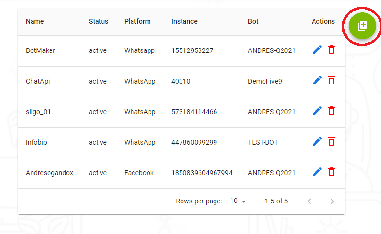
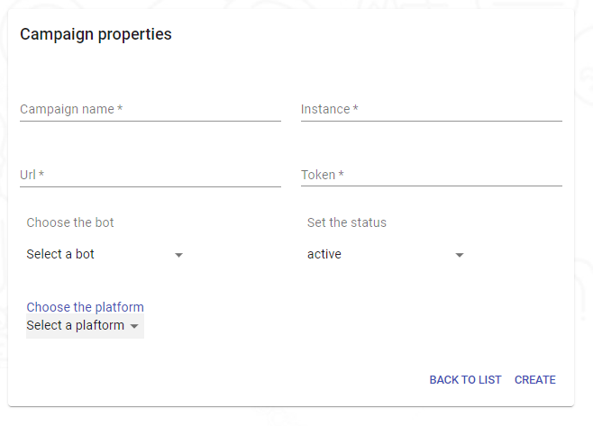
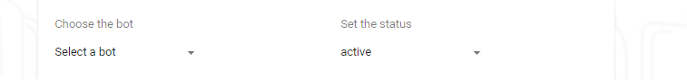

---

<h2>Create Campaigns</h2>

<h3>In this part we will see a small button. whatwhen we click on it ,will show us a screen to create our campaigns.</h3>

<h3>This would be our screen for the creation of the campaigns</h3>

<h3>In the creation of our campaign we have the option to enter with facebook, whatsapp, ChatApi etc.</h3>

<h3>When we log in with Facebook it does not fill in the fields that are only required which are URL, Instance, Token and campaign name, and for Whatsaap and others we should do it manually</h3>

<h3>This part is to select our bot`s that we already created, we also have the option to manage our status where we can put our campaign active or inactive.</h3>

<h3>and when we click on create campaign we are redirected to our screen that allows us to view all campaigns</h3>
