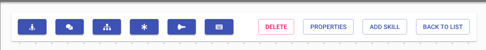

---

<h2>Crear y editar</h2>

<h3>Aquí podemos hacer clic en este botón donde nos da la opción de crear nuestro Bot`s donde se nos presentará la siguiente pantalla</h3>

<h3>en esta pantalla podremos agregar solo el nombre de nuestro Bot`s luego pasamos a editarlo donde se nos presentará la siguiente pantalla</h3>

---

<h2>Barra de herramientas</h2>

<h3>Aquí tenemos todo lo necesario para la construcción del flujo y para la configuración de cada paso dentro del flujo.</h3>

<h3>Área de construcción del flujo</h3>

---

<h2>Definición de los módulos</h2>

<h3>

-SkillTransfer: Este estado está en proceso de creación y no se utilizará por el momento</h3>

<h3>

 - Message: La respuesta de nuestro bot al recibir un mensaje</h3>

<h3>

 -Case: Es donde vamos a mostrar una opción a nuestro cliente donde podemos poner varios mensajes y cada mensaje trae una respuesta al cliente.</h3>

<h3>Por ejemplo:</h3>

<h2>Definicion de los Campos</h2>

<h3>Nombre del caso:</h3>
<h3>Titulo del caso:</h3>
<h3>Ramas:</h3>

<h3>

-Conector: Este módulo está en proceso por el momento no lo vamos a utilizar.</h3>

<h3> 

- Five9Chat: Este módulo se utilizará para la conexión con Five9 donde tenemos que pasar la campaña que queremos recibir en five9 también debemos añadir los Inquilinos que sería en este caso nuestro cliente.</h3>

<h3>Por ejemplo:</h3>

<h2>Definicion de los Campos</h2>
<h3>Name:</h3>
<h3>Campaign:</h3>
<h3>Tenant:</h3>
<h3>Atributos:</h3>

<h3>

- Input: Es donde vamos a guardar la información y esta información se pasará a una variable donde podremos llamarla en el módulo Five9Chat.
</h3>

<h3>Por ejemplo::</h3>

<h2>Definicion de los Campos</h2>

<h3>RegExp: </h3>

---