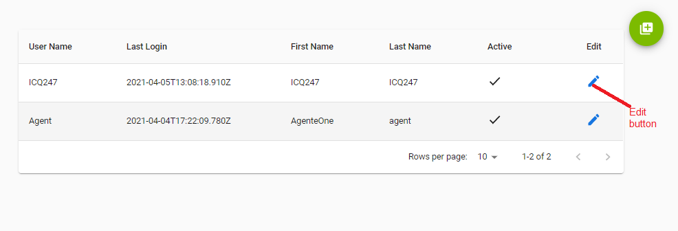
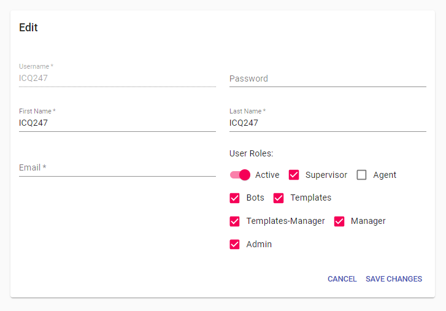

---

<h3>Aqui le mostraremos la parte de editar los usuarios,
Ahora haremos click en el icono aqui un pequeño ejemplo:</h3>

<h3>Aqui estaria nuestra pantalla de edicion donde podemos cambiar las diferentes informaciones que tenemos a la vista</h3>

<li>Save Changes: Para guardar Nuestos cambios</li>
<li>Cancel: Destacar los cambios hechos</li>

---
