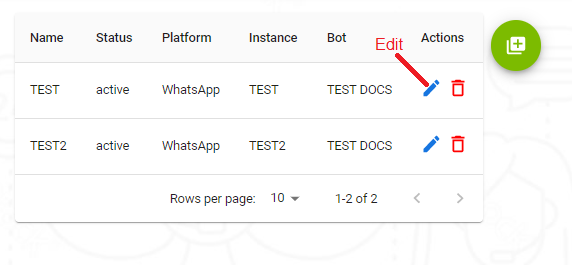
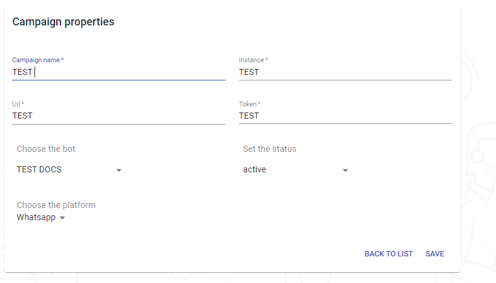
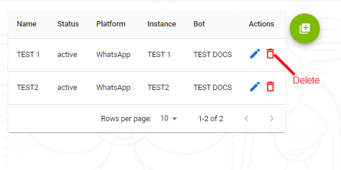
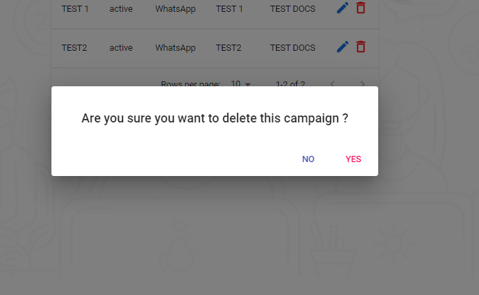
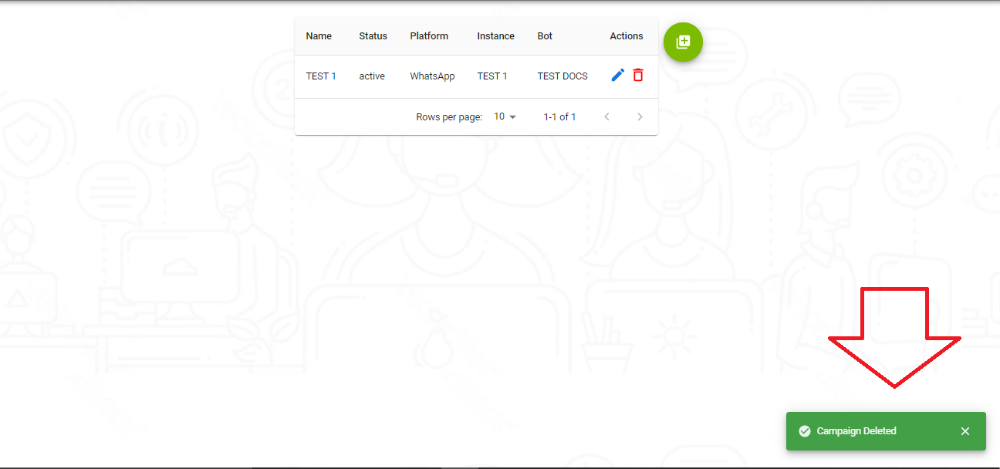

---

<h3>Aqui le explicaremos como editar sus campañas y como eliminarlas</h3>

<h3>Empecemos con la parte de editar nuestras campañas</h3>

<h3>Cuando le damos click a las parte de editar nos trae la siguiente pantalla</h3>

<h3>Aqui podemos editar nustras informaciones y desde que le damos click a save nos guarda los cambios agregados o si no queremos agregar nada solo queriamos visuilizar las informaciones que 
tenia nuestra campaña le damos click a regresar a nuestra lista de campañas</h3>

---

<h3>En esta parte veremos la de eliminar nuestras campañas</h3>

<h3>Cuando le damos click al icono de eliminar nos presenta la siguiente pantalla de confirmacion</h3>

<h3>Esta pantalla es para la confirmacion de que si esta seguro que quiere eliminar su campaña con todos sus datos que ha ingresado despues de confirmar si queremos o no eliminar nuestra campaña nos redirecione a nuestra lista donde estan todas nuestras campañas</h3>

<h3>Cuando le damos click a que si queremos eliminar nuestra campaña nos presenta que nuestra campaña se ha eliminado correctamenteen el lado derecho.</h3>

