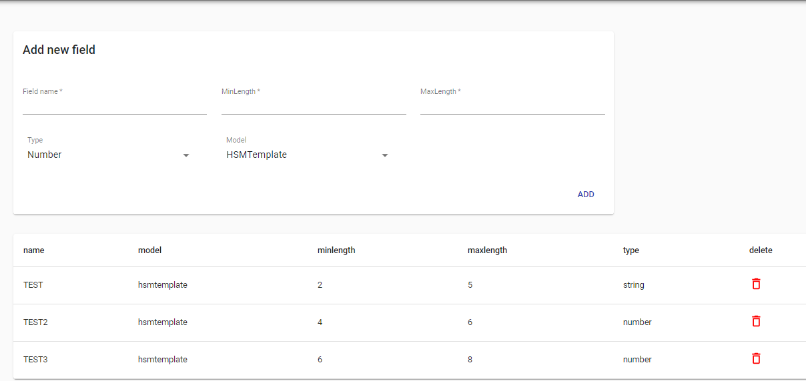

---

<h2>Añadir nuevos campos</h2>

<h3>En esta parte es donde creamos nuestros campos a utilizar en nuestra instacia estos son campos personalizados que tendremos a utilizar en nuestra instancia</h3>

<h3>Vamos a definir cada campos para que entendamos el uso de cada uno de ellos</h3>

<h3><a>Field name:</a>  Este seria Nuesto noombre del campo</h3>

<h3><a>Type:</a> Aqui selecionamos que tipo de modelo sera nuestro campo </h3>

<h3><a>Model:</a> Este seria el modelo de nuestro campo al que estara relacionado</h3>

:::info

Los campos no tienen la opcion de edicion haci que debemos crearlo con la informacion que vamos a utilizar ya que una vez creado no podra ser editado.

:::

---
