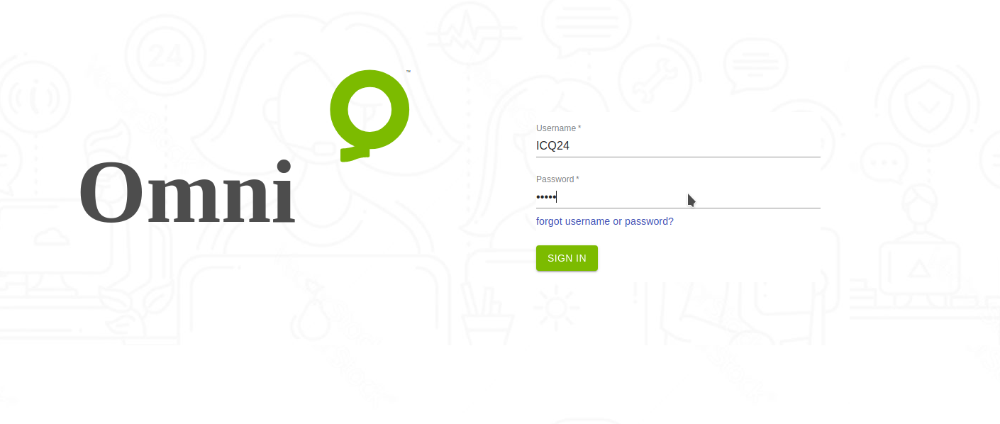
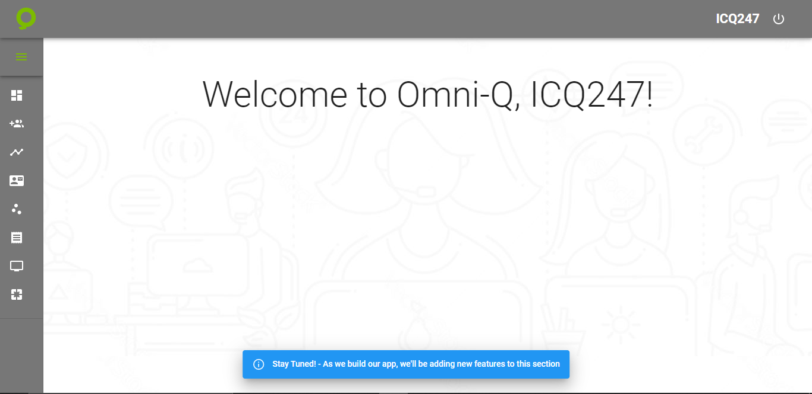

---

<h2>Aqui veremos Como Ingresar a nuestra Instancia</h2>

<h3>Para entrar en nuestra instancia debes acceder a la dirección y proceder a registrarte con tus credenciales</h3>

<a href="https://omniq.icq24.com">OmniQ</a>

 

<h3>Después de iniciar la sección debemos seleccionar qué área vamos a requerir
</h3>

<h3> Aquí seleccionaremos si queremos ser Gerente o Agente.
</h3>

<h3>En este momento estamos visualizando la parte de Manager donde tenemos todos los modulos disponibles de nuestra instancia</h3>

<h3>Esta es nuestra pagina de inicio desde que entramos a la instancia</h3>

---

:::info

¡Esté atento! - A medida que vayamos construyendo nuestra aplicación, iremos añadiendo nuevas funciones a esta sección

:::

