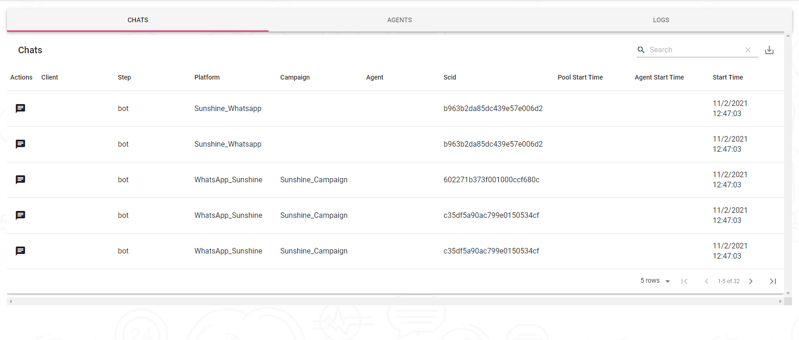
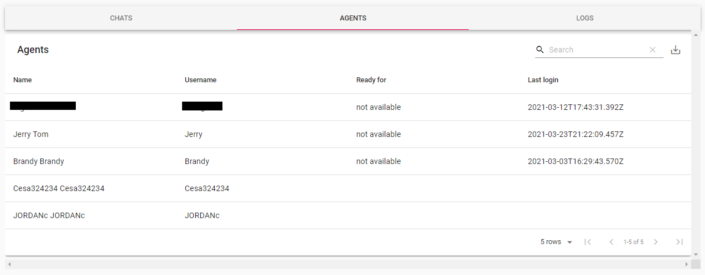
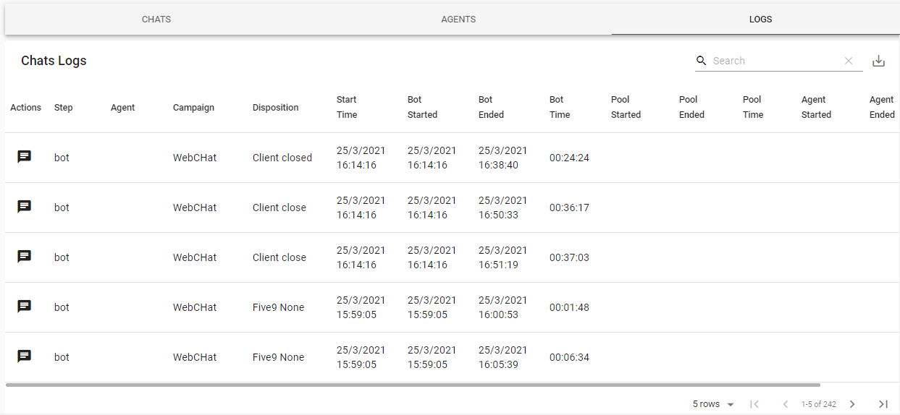

---

### Here is the part of the monitoring of the chats where we will see the finished chats used for quality purposes and to see if our agents are working correctly, we can visualize the interaction that an agent has had with the customer.

### View Chats

### This is the agent part where is the administrative management where we are going to visualize the status of our agents if they are available, resting or inactive.

### Here we will visualize our chat history where we have all our interactions we also have the option to see the interaction with the client that the agent had.

### We also have the option to export our Chats, Agent and Chats logs.

