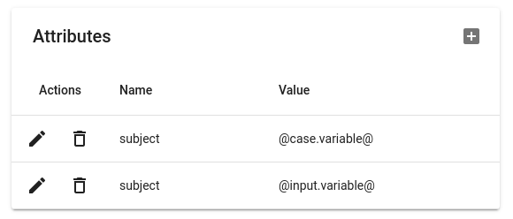

---

<h2>Definicion de Nodos</h2>

<h3>  <a>-SkillTransfer:</a>  Este estado está en proceso de creación y no se utilizará por el momento</h3>

<h3> <a>- Message:</a>  La respuesta de nuestro bot al recibir un mensaje</h3>
 
 

<h3>Aqui estamos visualizando la pantalla del nodo de mensaje donde tenemos dos campos y un selector Vamos a explicar para que sirve</h3>

<h3><a>Name:</a>  Este es el nombre a identicar nuestro Nodo</h3>
 
<h3><a>Message:</a>  Es donde vamos a estructurar nuestro mensaje</h3>
 
<h3><a>Go Next:</a>  Es para dar una continuacion a otro mensaje u otra accion del bot</h3>

---

<h3> <a>- Case:</a>  Aqui es donde vamos agregar varias opciones para que nuestro cliente elija dependiendo su necesidad.</h3>

<h3><a>Por Ejemplo:</a></h3>

<h2>Definicion de los Campos</h2>

<h3><a>Nombre del caso:</a>   Este Seria Nuestro Nombre a Identificar el Case</h3>
<h3><a>Titulo del caso:</a>   Este Campo seria el titulo del mensaje para darle Una introduccion o informacion</h3>
<h3><a>Vifurcacion:</a>   Es donde vamos a poder darle la opcion al cliente de tener varios opciones a eligir</h3>

---

<h3> <a>- Conector:</a>  Este módulo está en proceso por el momento no lo vamos a utilizar.</h3>

<h3> <a>- Five9Chat:</a>  En este parte es donde ya vamos hacer conexion con five9 como bien vemos nos pide que agregemos nuestra campaña y nuestro tenats y la parte de atributos es la parte donde le enviaremos a five9 parametros que mas adelante veran la explicacion de cada campo</h3>

<h3><a>Por Ejemplo:</a></h3>

<h2><a>Definicion de los Campos</a></h2>
<h3><a>Name:</a>  Nuestro Nombre del modulo a identificar</h3>
<h3><a>Campaign:</a>  Aqui debemos agregar nuestra campaña que tenemos en five9</h3>
<h3><a>Tenant:</a>  El Tenants es el dominio que tenemos en five9.</h3>
<h3><a>Atributos:</a> Aqui podremos llamar  variables que ya tenemos definidas en nuestro flujo, 
podemos llamar variables que tenemos definidas en los input o en los case aqui le mostraremos un ejemplo 
</h3>

<h3>Para llamar las variables debemos añadir una arroba"@" al principio y la siguiente al final por ejemplo: "@case.varible@" aqui lo que hacemos es llamar nuestro nodo y la variable que este dentro de ese nodo</h3>

<h3> <a>- Input:</a>  Es donde podemos almacenar variables para la captura de informacion estas variables la podemos llamar en el nodo de Five9
</h3>

<h3><a>Por Ejemplo:</a></h3>

<h2><a>Definicion de los Campos</a></h2>

<h3><a>Name:</a>  Este sera el nombre a idetificar nuestro input</h3>
<h3><a>RegExp:</a>  Este campo es para agregar multiples opciones ya que para cuando nuestro cliente digite algo relcionado con la opciones implementadas en nuestra expresion regular lo va a redirecionar a ese skill relacionada a la  opcion digitada</h3>

<h3>Aqui podemos ver dos  opciones agregadas en nuestra expresion regular</h3>

<h3>Cuando nuestro cliente esta interectuando con nuestro Bot si el cliente escribe una de estas opciones en el chats se va dirigir a un skill encargado a esas dos areas que serian "Service y Support"</h3>

---
