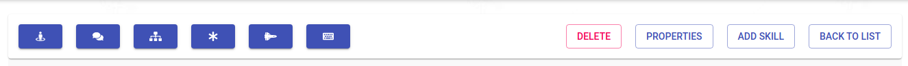
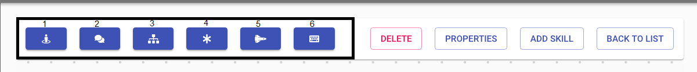
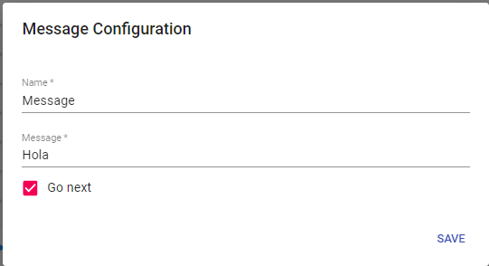
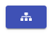
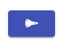

---

<h2>Definición de los Nodos</h2>

<h3>Barra de herramientas</h3>

<h3>Ahora vamos a explicarles para que funciona esta parte de la derecha mas adelante estara la parte izquierda</h3>

<h3>  -SkillTransfer: Este estado está en proceso de creación y no se utilizará por el momento</h3>

<h3> - Message: La respuesta de nuestro bot al recibir un mensaje</h3>
 
 

<h3>Aqui estamos visualizando la pantalla del nodo de mensaje donde tenemos dos campos y un selector Vamos a explicar para que sirve</h3>

<li>Name: Este es el nombre a identicar nuestro Nodo</li>
 
<li>Message: Es donde vamos a estructurar nuestro mensaje</li>
 
<li>Go Next: Es para dar una continuacion a otro mensaje u otra accion del bot</li>

---

<h3> - Case: Aqui es donde vamos agregar varias opciones para que nuestro cliente elija dependiendo su necesidad.</h3>

<h3>Por Ejemplo:</h3>

<h2>Definicion de los Campos</h2>

<h3>Nombre del caso:   Este Seria Nuestro Nombre a Identificar el Case</h3>
<h3>Titulo del caso:   Este Campo seria el titulo del mensaje para darle Una introduccion o informacion</h3>
<h3>Vifurcacion:   Es donde vamos a poder darle la opcion al cliente de tener varios opciones a eligir</h3>

---

<h3> - Conector: Este módulo está en proceso por el momento no lo vamos a utilizar.</h3>

<h3> - Five9Chat: Este módulo se utilizará para la conexión con Five9 donde tenemos que pasar la campaña que queremos recibir en five9 también debemos añadir los Inquilinos que sería en este caso nuestro cliente.</h3>

<h3>Por Ejemplo:</h3>

<h2>Definicion de los Campos</h2>
<h3>Name:  Nuestro Nombre del modulo a identificar</h3>
<h3>Campaign:  Esta seria la campaña que queremos recibir los chats recibidos</h3>
<h3>Tenant:  El Tenants es el dominio que tenemos en five9.</h3>
<h3>Atributos:  Este tema es para llamar variables que tenemos creadas en los input tambien </h3>

<h3> - Input: .
</h3>

<h3>Por Ejemplo:</h3>

<h2>Definicion de los Campos</h2>

<h3>Name:</h3>
<h3>RegExp: </h3>

---
