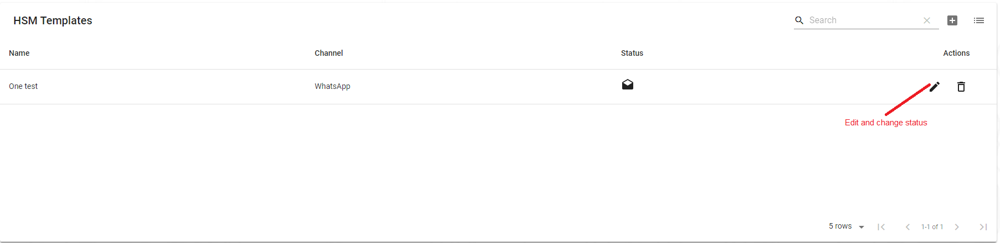
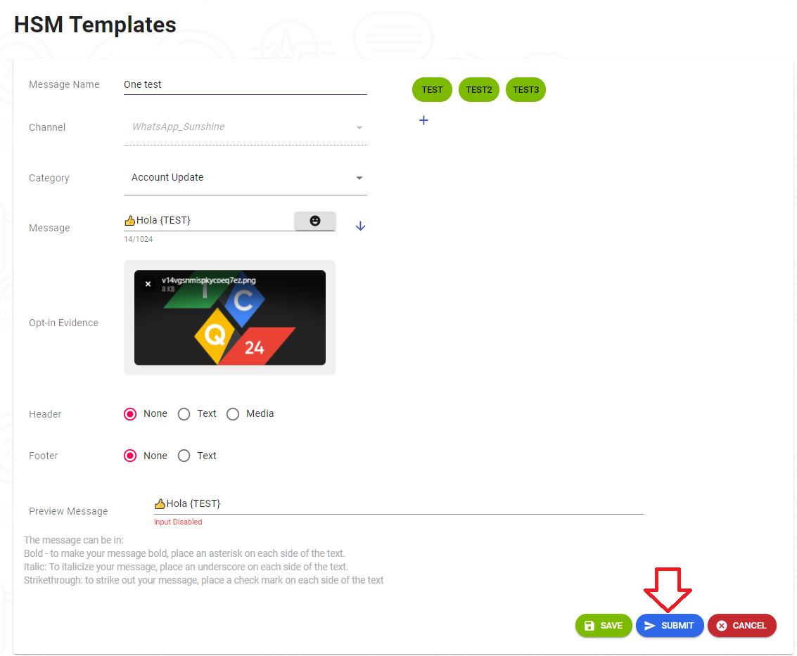
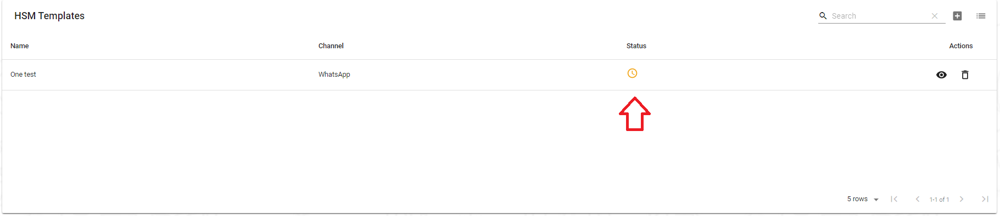
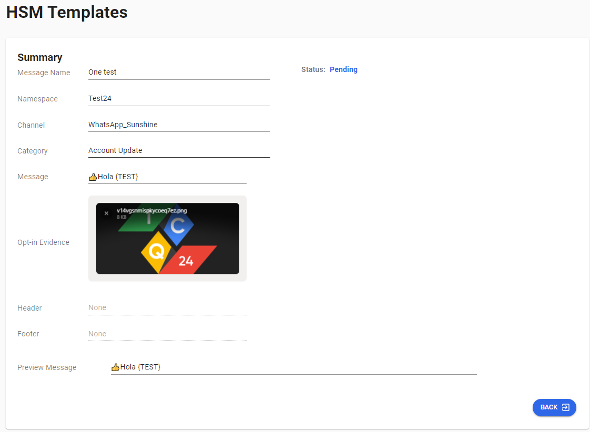
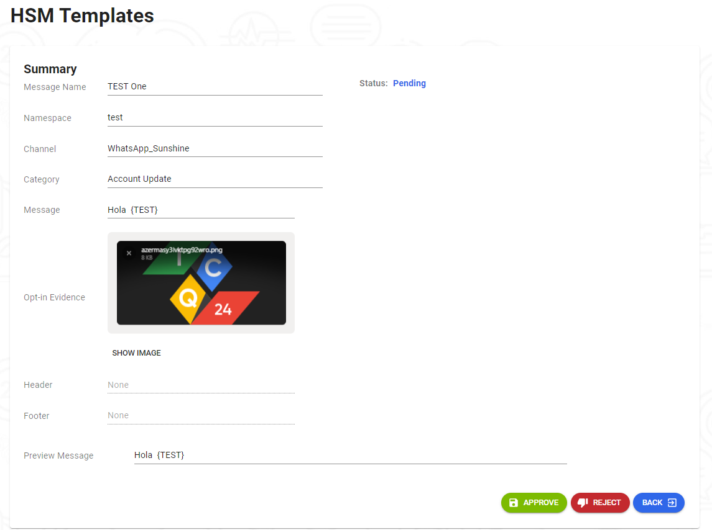

---

<h3>Cuando estamos creando nuestra plantilla despues de estructurarla tenemos la opcion de guardar o somermeterla</h3>

<h3>Si elegimos la opcion de guardar nuestra plantilla vamos a tener la opcion de editar nuestra plantilla</h3>

<h3>Y si elegimos someterla no tendremos la parte de edicion habilitada solo podremos visualizar la plantilla por que la someterla pasamos al estado de pendiente donde dicha plantilla esta siendo evaluada</h3>

<h3>Vamos a visualizar una plantilla que ya tenemos guardada entonces vamos a pasar a editar dicha plantilla</h3>

<h3>Le Daremos Click al boton de editarla plantilla</h3>

<h3>Ya estando dentro de la plantilla le damos click al boton de submit que en este caso ya entraremos al estado de pendiente</h3>

<h3>Despues de darle click nos redireciona a donde esta nuestra lista de las plantilla y nos muestra el status que esta en pediente a espera de que sea aprobada</h3>

<h3>En esta parte en Entramos ya a la parte administrativa donde vamos aprobar nuestra plantilla.   Nosotros  podemos aprobar nuestra plantilla por que estamos logeados con un usuario administrativo pero si no es un usuario administrativo solo podria  visualizarla</h3>

<h3>Esta seria la vista si no fuese usuario administrativo solo puedo pasar las plantillas a pendientes pero no aprobarlas o declinarlas</h3>

<h3>Y esta seria la vista administrativa donde podemos aprobar nuestra plantilla o declinarla si no cumple con lo requisitos planteados</h3>

