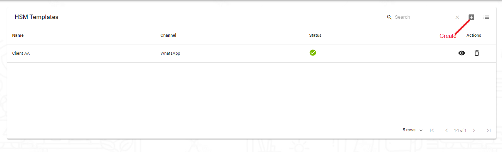
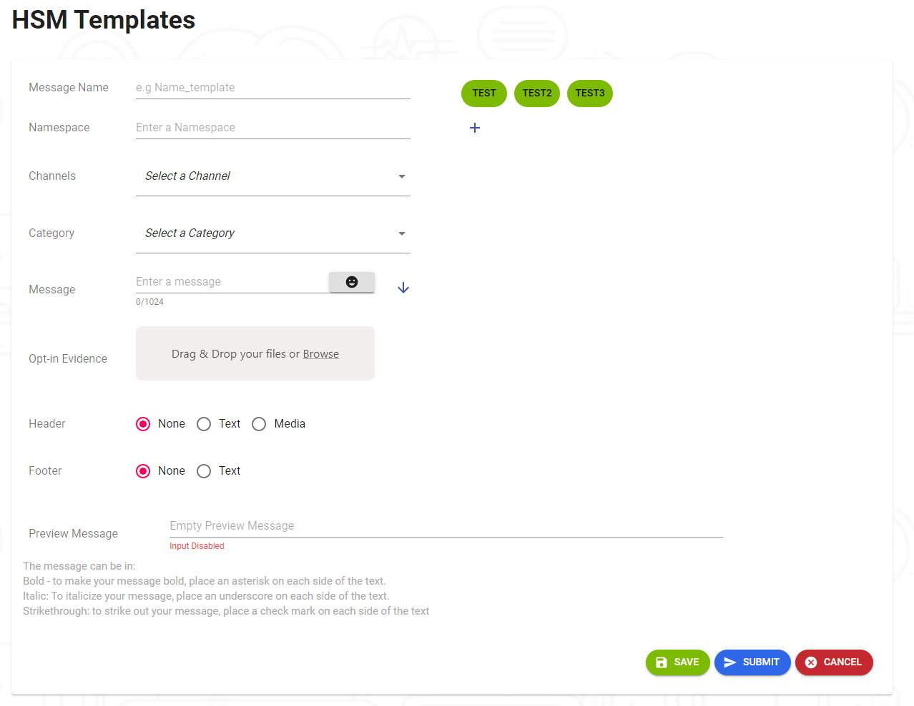
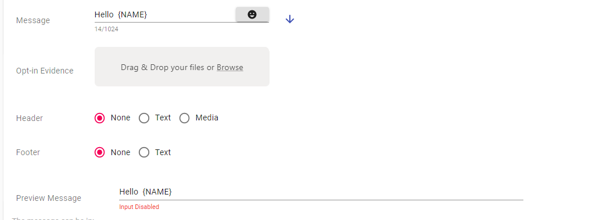
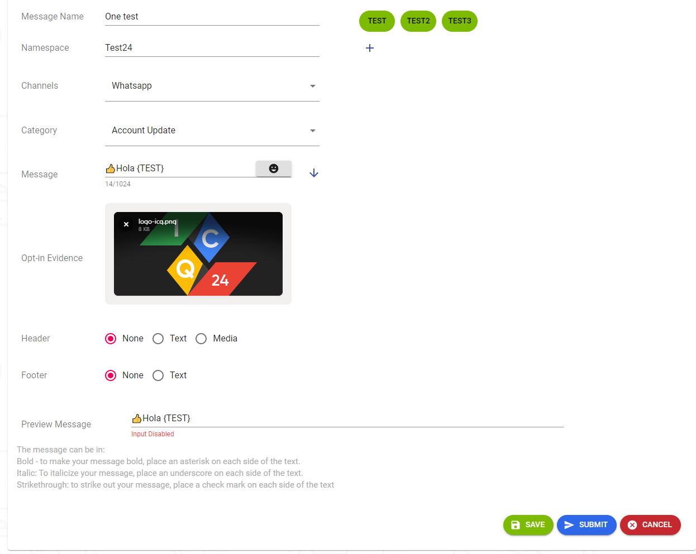

---

<h3>En esta parte le explicaremos como crear las plantillas luego de que creemos nuestra plantilla veremos el flujo que tenemos que implementar para usar la plantilla creada.</h3>

<h3>Le daremos click a nuestro icono de creacoon de plantilla y nos mostrara la siguiente pantalla</h3>

<h2>Definicion de los campos:</h2>
<h3><a>Nombre del Mensaje:</a>  Nombre a identeficar nuestra plantilla</h3>
<h3><a>Nombre de su espacio:</a>  </h3>
<h3><a>Canales:</a>  Aqui vamos a seleccionar el canal que vamos a utilizar en la plantilla</h3>
<h3><a>Categoria:</a>  Esta opcion para elegir que tipo o categoria seria la plantilla</h3>

---
<h3><a>Mensaje:</a>  Este es uno de los mas importante ya que este sera el mensaje que enviaremos mediante HSM LIST donde tenemos Un boton en la parte derecha que si hacemos click nos rellenaria nuesto campo de vista previa.</h3>
<h3><a>Aqui Un Ejemplo:</a></h3>
<h3>Para poder visualizar nuestro mensaje que ya cremos debemos hacer click aqui</h3> 

<h3>Luego de hacer click en este boton nos pasa lo que tenemos agregado al campo de vista previa</h3>

  

---
<h3><a>Evidencia de Aceptacion:</a>  Aqui es para agregar una evidencia de que el cliente quiere recibir el template a enviar</h3>
<h3><a>Encabezamiento:</a>  </h3>
<h3><a>Pie de Pagina:</a>  </h3>
<h3><a>Mensaje de Vista Previa:</a>  Aqui podremos ver una vista del mensaje ya creado</h3>

---

<!-- <h3>Para poder visualizar nuestro mensaje que ya cremos debemos hacer click aqui</h3>  

<h3>Luego de hacer click en este boton nos pasa lo que tenemos agregado al campo de vista previa</h3>

 -->

<h3>Ahora veremos la parte de la creacion de una plantilla y el flujo de las mismas</h3>

<h3>Como vemos aqui estamos creando nuestra plantilla que en este caso solo la vamos a guardar no la vamos a someter por que si la sometemos no tendremos la opcion de editar solo de visualizar la plantilla</h3>

<h3>ahora le daremos click a "SAVE" donde vamos a guardar nuestra plantilla luego pasamos a ver el flujo de las plantillas   </h3>

---
