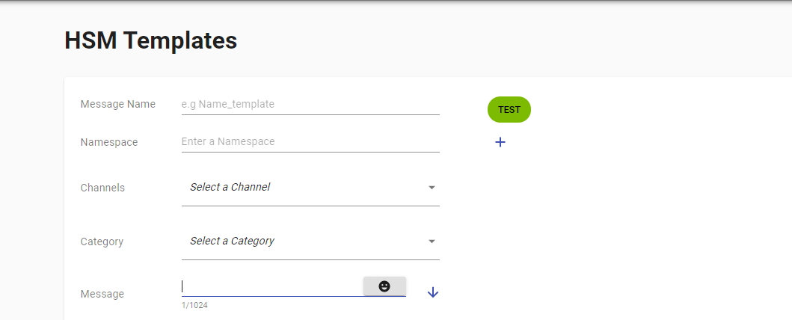
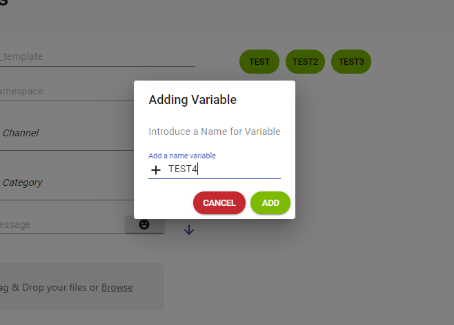
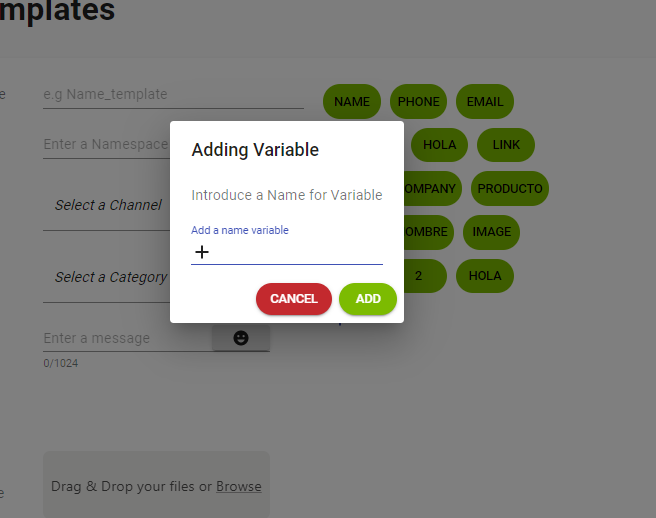

---

<h3>En esta parte le explicaremos como crear las plantillas luego de que creemos nuestra plantilla veremos el flujo que tenemos que implementar para usar la plantilla creada.</h3>

<h3>Le daremos click a nuesto icono de creacoon de plantilla y nos mostrara la siguiente pantalla</h3>

<h2>Definicion de los campos:</h2>
<h3>Nombre del Mensaje: Nombre a identeficar la plantilla</h3>
<h3>Nombre de su espacio: </h3>
<h3>Canales: Aqui vamos a seleccionar el canal que vamos a utilizar en la plantilla</h3>
<h3>Categoria: Esta opcion para elegir que tipo o categoria seria la plantilla</h3>
<h3>Mensaje: Este es uno de los mas importante ya que este sera el mensaje que enviaremos mediante HSM LIST</h3>
<h3>Evidencia de Aceptacion: Aqui es para agregar una evidencia de que el cliente quiere recibir el template a enviar</h3>
<h3>Encabezamiento: </h3>
<h3>Pie de Pagina: </h3>
<h3>Mensaje de Vista Previa: Aqui podremos ver una vista del mensaje ya creado</h3>

<li>Para poder visualizar nuestro mensaje que ya cremos debemos hacer click aqui</li>  

<h3>Luego de hacer click en este boton nos pasa lo que tenemos agregado al campo de vista previa</h3>

---

<h3>Ahora veremos como seria el uso de estos campos en las plantillas</h3>

<h3>En la creacion de la plantilla tenemos la opcion de ver los campos creado y tambien le brindamos la opcion de crearlos dentro del mismo aqui un ejemplo:   </h3>

<h3>Si le damos click al boton de crear nos abre la siguiente pantalla</h3>

<h3>Esta seria nuestra pantalla para la creacion de campos dentro de la creacion de las plantillas como podemos visualizar vamos agregar un campo llamado TEST4 desde que le damos al boton 

</h3>

<h3>ahora nos mostrara el campor que hemos creado llamado "TEST4"</h3>

<!-- <h3>Este seria el uso a los campos en las plantillas si quiere ver el tema de envio de mensaje <a href="/docs/templateListContact">Click Aqui!</a></h3> -->

---
