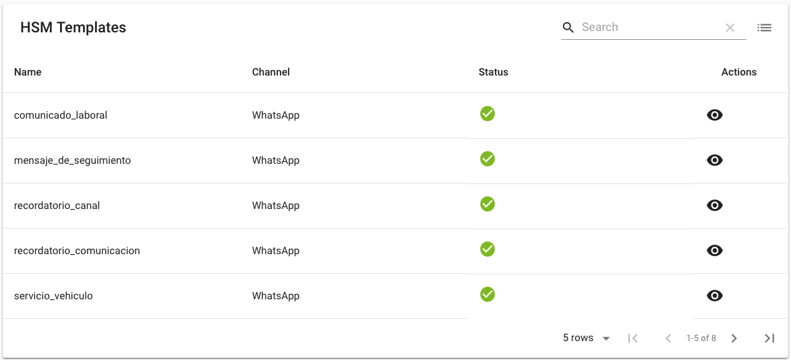
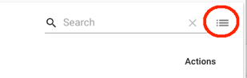
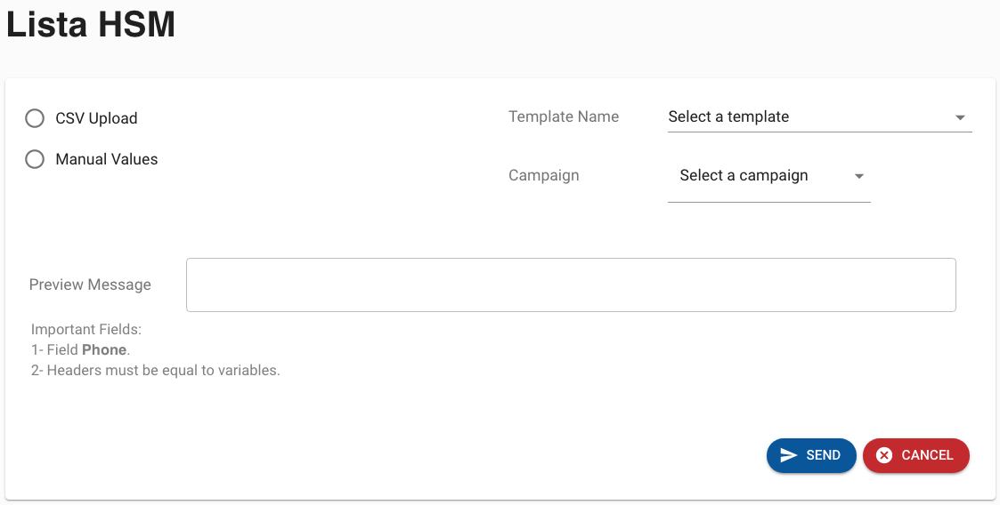

---

## TemplatesList

### All the templates currently registered in the system and their different statuses are shown here.

### At the bottom, you can select the number of records you want to display in the template list, by default it loads 5.

## This part is for sending mass messages.

---

## Sending Mass Messages

### By selecting the option at the top right, the following screen will be displayed

### On this page is where you select the template to send and upload the information with the list of contacts to whom you want to send the required template.

---

### The following steps must be followed:

### **1-** Select the "template name", this refers to choosing the template you want to send.

### **2-** Select "Campaign", here you must select the campaign associated to the telephone number through which the messages will be sent to the clients.

### **3-** A CSV file must be uploaded, containing all the numbers to be contacted by sending mass messages, and it must have the following structure.

#### It must contain a field with the header name "phone" that corresponds to the phone numbers of the users to whom the messages will be sent.

#### If it contains variables in the template, there must be an additional column for each variable in the file and it must have the same column name as the header.

### **4-** The page will show you a preview of the first message in the list so that you can visualize how the message will be delivered to the end customer.

### **5-** The page will load the records from the submitted file to display the records to be processed.

### **6-** Once everything is loaded in the system this is the view that is shown with all the information ready to be sent.

### **7** Once everything is ready, click on the button at the bottom right called SEND.

### **8** A confirmation message appears on the screen to make sure you really want to process sending the messages with the pre-loaded list

#### Once the YES SEND button is clicked, all messages will be sent.

### **9** At the bottom center, a message will be displayed notifying the status of the shipment.

#### Whether the contact list was sent successfully or if there was an error processing the sending of the messages.
