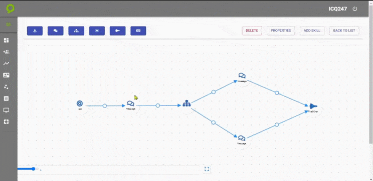

---

<h3>Ahora vamos a explicarles para que funciona esta parte de la derecha mas adelante estara la parte izquierda</h3>

<h3>vamos a definir todos los 4 botones que tenemos disponibles en nuestra barra de herramientas</h3>

---

<h3><a>Delete:</a>si queremos Utilizar este boton debemos selecionar el nodo o la transicion que queremos eliminar</h3>

<h3>Aqui un ejemplo de como hacerlo</h3>

<h3><a>Properties:</a> Aqui es para ver las pantallas de cada nodo, para poder agregar las informaciones</h3>

<h3>Aqui veremos como seria el uso de "Properties"</h3>

<h3>Este seria el uso que le daremos a properties vamos con el siguiente</h3>

<h3><a>ADD SKILL:</a> Este estado esta en Proceso mas adelante lo tendremos disponible por el momento no lo vamos a definir</h3>

<h3><a>BACK TO LIST:</a> Este tiene la funcion de regresarnos a nuestra vista principal donde veremos nuestra lista de Bot`s que ya tenemos creados</h3>
