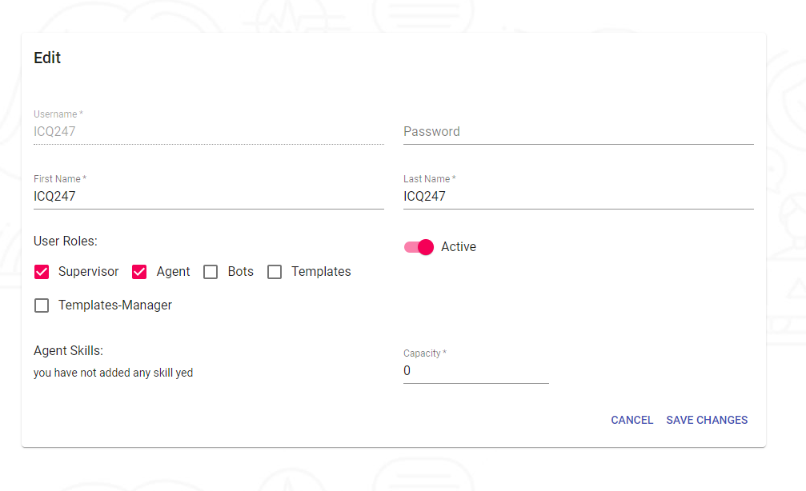

---

## View of all users

### Here we are going to visualize all the users of our organization with the respective fields where the first one is the name of the user, when was the last time he started section, First Name, Last Name, and when he is active and at the end the button to edit our user.

## Edit User

---

### Here we will be able to edit our user where we can change the password change to different roles such as Supervisor, Agent, Bot`s etc.

### We also have the option to deactivate users if that user is not being used or we do not want it to be used.

## Create User

---

## Here we will be able to create a user where we have the different roles and management of templates and bots.

