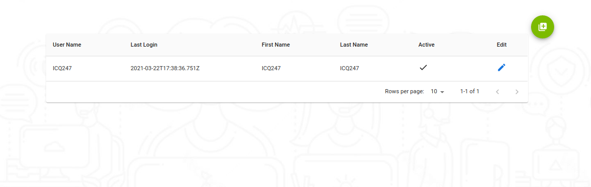

---

<h3>Aquí vamos a visualizar todos los usuarios de nuestra organización, donde tenemos la opción de editar usuarios y también la creación de usuarios</h3>

<h3>Tenemos la opcion de manejar nuestros usuarios manejar los diferentes roles disponibles que tenemos habilitados</h3>

<h3>Estos serian los diferentes roles que tenemos aqui veremos su repectiva definicion de cada uno</h3>

<h3>Supervisor: </h3>
<h3>Templates:</h3>
<h3>Templates-Manager:</h3>
<h3>Bot`s:</h3>
<h3>Agent:</h3>
<h3>Admin:</h3>

